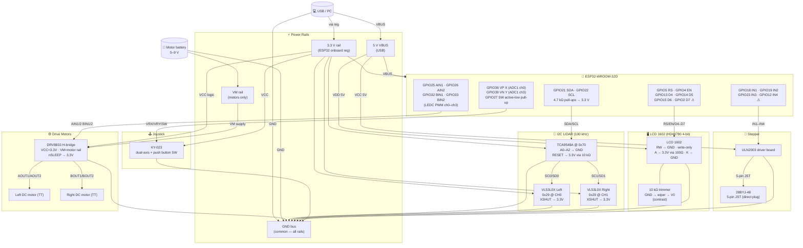

# Path-Following Robot — ESP32-WROOM-32D

> Bare-metal Rust firmware (`no_std`) for a LIDAR-guided path-following farm robot.  
> The robot **records** a joystick-driven path, then **replays** it autonomously
> while two VL53L0X I²C LIDARs detect and avoid obstacles in real time.  
> A TCA9548A I²C multiplexer routes both sensors over a single bus.  
> An LCD 1602 display shows FSM state; a 28BYJ-48 stepper (ULN2003 driver) controls
> a secondary axis.  WiFi telemetry and remote control are included.

---

## Table of contents

- [Requirements](#requirements)
- [Build variants](#build-variants)
- [Quick start](#quick-start)
- [How to flash](#how-to-flash)
- [Hardware](#hardware)
  - [Bill of materials](#bill-of-materials)
  - [Pin assignment table](#pin-assignment-table)
  - [Wiring diagram](#wiring-diagram)
- [Software architecture](#software-architecture)
  - [Layer diagram](#layer-diagram)
  - [Dependency graph](#dependency-graph)
  - [Boot sequence](#boot-sequence)
- [State machine](#state-machine)
- [WiFi protocol](#wifi-protocol)
- [Configuration reference](#configuration-reference)
- [Project structure](#project-structure)
- [Testing](#testing)
- [Documentation index](#documentation-index)

---

## Requirements

### Hardware

| Item | Spec | Notes |
|---|---|---|
| Microcontroller | ESP32-WROOM-32D | The `-32D` variant has 4 MB flash |
| USB–UART adapter | CP2102 or CH340 | Usually built into dev boards |
| Motor driver | DRV8833 | Dual H-bridge; 1.5 A per channel |
| DC motors | 3–10 V, ≤1.5 A each | Two differential-drive wheels |
| I²C multiplexer | TCA9548A or PCA9548A | Routes both LIDARs over one I²C bus |
| LIDAR sensors | VL53L0X × 2 | I²C, 3.3 V; one per mux channel |
| LCD display | 1602 (HD44780, no I²C backpack) | 4-bit parallel; 5 V power, 3.3 V data |
| Stepper driver | ULN2003 breakout | Drives 28BYJ-48 unipolar stepper |
| Stepper motor | 28BYJ-48 | 5 V unipolar; half-step mode |
| Joystick module | Analog XY + push button | KY-023 or equivalent |
| Power supply (logic) | 3.3 V / 500 mA | Supplied by dev board regulator |
| Power supply (motors) | 5–10 V / 3 A | Separate rail; do not share with logic |

### Software (development machine)

| Tool | Minimum version | Install |
|---|---|---|
| Rust stable | 1.88 | `rustup toolchain install stable` |
| Rust esp toolchain | latest | `cargo install espup && espup install` |
| espflash | 3.0 | `cargo install espflash` |
| Python | 3.8 | *(optional — monitor scripts only)* |

Tested on macOS 14 (arm64) and Ubuntu 22.04 (x86_64).

---

## Build variants

The firmware ships three binary targets selectable by Cargo feature, plus a
host-side telemetry server:

| Variant | Binary | Feature | Toolchain | Hardware required | WiFi |
|---|---|---|---|---|---|
| **Production** | `path-following-robot` | *(default)* | `esp` | TCA9548A + 2× VL53L0X + full BOM | ✅ |
| **Dev / debug** | `path-following-robot-dev` | `dev` | `esp` | 1× VL53L0X direct (no mux) + LCD 1602 | ❌ |
| **Wokwi sim** | `path-following-robot-sim` | `sim` | `esp` | None — runs in Wokwi browser simulator | ❌ |
| **Fleet server** | `telemetry-server` | `host-server` | `stable` | None (host binary) | — |

```bash
# ESP32 targets — requires: source ~/export-esp.sh
cargo +esp build --release                                                  # production
cargo +esp build-dev                                                        # dev
cargo +esp build-sim                                                        # Wokwi sim

# Host telemetry server — +stable required (overrides xtensa default)
cargo +stable build-server                                                  # macOS arm64
cargo +stable build-server-linux                                            # Linux x86_64
# or equivalently:
cargo +stable build --features host-server --bin telemetry-server \
      --target aarch64-apple-darwin        # macOS arm64
#     --target x86_64-unknown-linux-gnu    # Linux x86_64
```

> ⚠️ **Alias invocation:** `+toolchain` must come from the *caller*, not the alias
> value — `cargo build-server` alone will not work.  Always use
> `cargo +stable build-server` / `cargo +esp build-firmware`.
> See [Runbook 05 — Troubleshooting](docs/runbooks/05-troubleshooting.md) for details.

The **dev** variant wires a single VL53L0X directly to the I²C bus (no TCA9548A), replaces the right sensor with an `AlwaysClear` stub so the robot can exit `AVOIDING`, and shows the current FSM state + LIDAR distance on the LCD 1602.

The **sim** variant replaces both I²C LIDARs with `StubDistance` stubs and omits WiFi so the firmware compiles cleanly for Wokwi.

---

## Quick start

```bash
# ── 1. One-time toolchain setup ───────────────────────────────────────────────
cargo install espup && espup install
source ~/export-esp.sh                # add to ~/.zshrc or ~/.bashrc

cargo install espflash

# ── 2. Clone and configure ────────────────────────────────────────────────────
git clone <repo-url> path-following-robot-esp32-wroom-32d
cd path-following-robot-esp32-wroom-32d

# Edit src/config.rs — set WIFI_SSID and WIFI_PASSWORD
#   The robot obtains its IP via DHCP — no static address needed

# ── 3. Verify with host unit tests (no ESP32 needed) ──────────────────────────
cargo +stable test --lib --target aarch64-apple-darwin
# Expected: test result: ok. 47 passed; 0 failed

# ── 4. Build release firmware ─────────────────────────────────────────────────
cargo +esp build --release

# ── 5. Flash and open serial monitor ─────────────────────────────────────────
espflash flash --monitor \
  target/xtensa-esp32-none-elf/release/path-following-robot
```

> **New to the hardware?** See [Runbook 10 — Step-by-Step Flashing and Wiring Guide](docs/runbooks/10-flashing-and-wiring-guide.md) for a full walkthrough including assembly, power rails, and first-boot verification.

---

## How to flash

### Step 1 — Enter download mode

Most ESP32 dev boards auto-reset into download mode when `espflash` opens the
port.  If your board does not:

1. Hold the **BOOT** button.
2. Press and release **RESET** / **EN**.
3. Release **BOOT**.

The blue LED stays on when download mode is active.

### Step 2 — Flash

```bash
# Auto-detect port (works on most systems)
espflash flash --monitor \
  target/xtensa-esp32-none-elf/release/path-following-robot

# Explicit port
espflash flash --port /dev/cu.usbserial-0001 --monitor \
  target/xtensa-esp32-none-elf/release/path-following-robot

# Flash without opening monitor (silent)
espflash flash \
  target/xtensa-esp32-none-elf/release/path-following-robot
```

`espflash` strips debug symbols and compresses the binary before writing.
A release build flashes in approximately 10 seconds.

### Step 3 — Verify boot

After flashing, the serial monitor shows:

```
ESP-ROM:esp32-eco3
rst:0x1 (POWERON_RESET),boot:0x13 (SPI_FAST_FLASH_BOOT)
…
I (321)  path_following_robot: === path-following-robot booting ===
I (330)  path_following_robot: LEDC: 4 × 8-bit channels @ 1000 Hz
I (335)  path_following_robot: I2C: SDA=GPIO21  SCL=GPIO22  @ 100 kHz
I (340)  path_following_robot: TCA9548A: mux @ 0x70 — ch0=left  ch1=right
I (345)  path_following_robot: VL53L0X left:  init OK
I (350)  path_following_robot: VL53L0X right: init OK
I (355)  path_following_robot: ADC: joystick X=GPIO36  Y=GPIO39
I (357)  path_following_robot: Button: GPIO27 (active-low, internal pull-up)
I (365)  path_following_robot: WiFi connecting to "YourSSID"...
I (4230) path_following_robot: WiFi: connected — IP 192.168.1.42 — remote control + telemetry enabled
I (4231) path_following_robot: Robot ready — entering main loop at ~100 Hz
I (4232) path_following_robot: State: IDLE
```

The robot is ready when `State: IDLE` appears.  Press the joystick button to
begin recording.

### Log level

```rust
// src/bin/main.rs
// debug builds already set LevelFilter::Debug automatically
log::set_max_level(log::LevelFilter::Trace);  // most verbose
log::set_max_level(log::LevelFilter::Info);   // production default
```

---

## Hardware

### Bill of materials

| Qty | Part | Description | Approx. cost |
|---|---|---|---|
| 1 | ESP32-WROOM-32D dev board | e.g. ESP32-DevKitC-V4 | $5 |
| 1 | DRV8833 breakout | Dual H-bridge motor driver | $2 |
| 1 | TCA9548A or PCA9548A breakout | 8-channel I²C multiplexer | $3 |
| 2 | VL53L0X breakout | I²C time-of-flight LIDAR (up to 2 m) | $3 each |
| 1 | LCD 1602 (no backpack) | HD44780 character display; 4-bit parallel | $2 |
| 1 | ULN2003 driver board | Stepper motor driver for 28BYJ-48 | $1 |
| 1 | 28BYJ-48 stepper motor | 5 V unipolar; 64-step/rev geared | $2 |
| 1 | KY-023 joystick | Analog XY + tactile button | $1 |
| 2 | DC gear motor | 6 V, ≤1 A each | $4 each |
| — | 4.7 kΩ resistors × 2 | I²C SDA/SCL pull-ups | < $0.10 |
| 1 | 5–9 V power bank or LiPo | Motor + stepper + LCD supply | — |
| — | Jumper wires, breadboard | — | — |

### Pin assignment table

| Signal | ESP32 GPIO | Interface | Notes |
|---|---|---|---|
| Motor AIN1 | 25 | LEDC PWM ch0 | Left wheel forward |
| Motor AIN2 | 26 | LEDC PWM ch1 | Left wheel reverse |
| Motor BIN1 | 32 | LEDC PWM ch2 | Right wheel forward |
| Motor BIN2 | 33 | LEDC PWM ch3 | Right wheel reverse |
| I²C SDA | 21 | I²C | Shared bus — TCA9548A + both VL53L0X |
| I²C SCL | 22 | I²C | 100 kHz; 4.7 kΩ pull-up to 3.3 V required |
| LCD RS | 5 | GPIO output | Register select (cmd/data) |
| LCD EN | 4 | GPIO output | Enable clock (data latched on falling edge) |
| LCD D4 | 13 | GPIO output | 4-bit data bus bit 4 |
| LCD D5 | 14 | GPIO output | 4-bit data bus bit 5 |
| LCD D6 | 15 | GPIO output | 4-bit data bus bit 6 |
| LCD D7 | 2 ⚠ | GPIO output | 4-bit data bus bit 7 — strapping pin; must be HIGH at reset |
| Stepper IN1 | 18 | GPIO output | ULN2003 coil 1 |
| Stepper IN2 | 19 | GPIO output | ULN2003 coil 2 |
| Stepper IN3 | 23 | GPIO output | ULN2003 coil 3 |
| Stepper IN4 | 12 ⚠ | GPIO output | ULN2003 coil 4 — strapping pin; must be LOW at reset |
| Joystick X | 36 (VP) | ADC1 ch0 | Input-only; no pull resistor needed |
| Joystick Y | 39 (VN) | ADC1 ch3 | Input-only; no pull resistor needed |
| Joystick BTN | 27 | GPIO input | Active-low, internal pull-up enabled |

> ⚠ **GPIO2 (LCD D7)** is a strapping pin. The LCD bus holds it HIGH through the 4-bit bus at
> reset — this is safe. Do **not** add an external pull-down.  
> ⚠ **GPIO12 (Stepper IN4)** is a strapping pin. The ULN2003 output defaults LOW — safe.
> Never add a pull-up resistor to GPIO12.

All GPIO signals are 3.3 V. Do **not** connect 5 V signals directly to GPIO pins.

### Wiring diagram

> A full per-component wiring reference with assembly checklist is in
> [Runbook 06 — Hardware Wiring](docs/runbooks/06-hardware-wiring.md) and
> [Runbook 10 — Step-by-Step Flashing and Wiring Guide](docs/runbooks/10-flashing-and-wiring-guide.md).



> **Power rails:** Logic (3.3 V) and motor/stepper (5 V) must be separate.  
> Never power motors or the 28BYJ-48 from the ESP32 3.3 V regulator.  
> LCD VDD **must** be 5 V — 3.3 V gives dim or no display.  
> I²C pull-ups go to 3.3 V, **not** 5 V.

---

## Software architecture

### Layer diagram

```
  ┌────────────────────────────────────────────────────────────────────────────┐
  │              src/bin/main.rs  (production)                                 │
  │              src/bin/main_dev.rs  (dev / debug, feature = dev)             │
  │              src/bin/main_sim.rs  (Wokwi, feature = sim)                   │
  │   Composition roots — ESP32 entry points                                   │
  │   Initialise peripherals, construct adapters, own the Robot aggregate,     │
  │   run the 100 Hz cooperative loop:  robot.tick(now_ms)                     │
  └──────────────────────────────┬─────────────────────────────────────────────┘
                                 │ constructs & owns
  ┌──────────────────────────────▼─────────────────────────────────────────────┐
  │                       DOMAIN  (no_std, no esp-hal)                         │
  │  ┌────────────────────────────────────────────────────────────────────┐    │
  │  │  Robot<M: MotorPort, L: DistancePort, I: InputPort, W = NoWifi>    │    │
  │  │                                                                    │    │
  │  │  FSM:  IDLE → RECORD → READY → PLAY ⇄ AVOIDING → HALT            │    │
  │  │  Path: PathBuffer  (heapless::Vec<PathCommand, 512>)               │    │
  │  └────────────────────────────────────────────────────────────────────┘    │
  └──────────┬──────────────────────────────────────────────────┬──────────────┘
             │ calls via trait                                   │ calls via trait
  ┌──────────▼────────────────────────┐   ┌─────────────────────▼──────────────┐
  │            PORTS                  │   │             PORTS                   │
  │  MotorPort        — set_throttle  │   │  RemoteControlPort — poll_button    │
  │  DistancePort     — read_cm       │   │                    — poll_throttle  │
  │  InputPort        — poll_button   │   │  TelemetryPort     — send(&frame)   │
  │                   — read_throttle │   └──────────────┬──────────────────────┘
  └──────────┬────────────────────────┘                  │
             │ implemented by (xtensa only)               │ implemented by (xtensa only)
  ┌──────────▼────────────────────────┐   ┌──────────────▼──────────────────────┐
  │       ADAPTERS / esp32            │   │       ADAPTERS / esp32               │
  │                                   │   │                                      │
  │  Drv8833      LEDC PWM × 4        │   │  WifiAdapter                        │
  │  TCA9548A     I²C mux driver      │   │    esp-radio 0.18 (ISR-driven)       │
  │  Vl53l0x (×2) via TCA9548A ch0/1  │   │    smoltcp 0.12 (UDP sockets)        │
  │  Vl53l0xDirect  single, no mux    │   │    block_on spin-loop (connect)      │
  │  Lcd1602      HD44780 4-bit       │   │                                      │
  │  Uln2003      28BYJ-48 stepper    │   │                                      │
  │  Esp32Joystick  ADC1 + GPIO       │   │                                      │
  └───────────────────────────────────┘   └──────────────────────────────────────┘
             │                                           │
  ┌──────────▼───────────────────────────────────────────▼──────────────────────┐
  │                          esp-hal  1.1.1                                      │
  │  LEDC · I²C · ADC1 · GPIO · TIMG · RNG · RADIO_CLK · WIFI peripheral        │
  └──────────────────────────────────────────────────────────────────────────────┘
             │
  ┌──────────▼───────────────────────────────────────────────────────────────────┐
  │                     ESP32-WROOM-32D Hardware                                 │
  │  DRV8833 motors · TCA9548A + 2× VL53L0X · LCD 1602 · ULN2003/28BYJ-48      │
  │  KY-023 joystick · 2.4 GHz WiFi                                              │
  └──────────────────────────────────────────────────────────────────────────────┘
```

The domain layer has **zero** `esp-hal` imports.  The entire `adapters/esp32/`
subtree is gated `#[cfg(target_arch = "xtensa")]` so it is never compiled on
the host.

### Dependency graph

```
path-following-robot (bin)
├── path_following_robot (lib)
│   ├── domain::robot       — FSM, no external deps beyond heapless + log
│   ├── domain::path        — PathBuffer (heapless::Vec)
│   ├── domain::state       — RobotState enum
│   ├── ports::*            — trait definitions (zero deps)
│   └── adapters::esp32::*  — [xtensa only]
│       ├── esp-hal  1.1.1
│       ├── esp-radio 0.18  (WiFi; replaces esp-wifi)
│       ├── esp-rtos 0.3    (RTOS scheduler for WiFi background tasks)
│       ├── smoltcp  0.12   (proto-ipv4, socket-udp, medium-ethernet)
│       ├── esp-alloc 0.10  (global allocator for WiFi heap)
│       └── embassy-net-driver 0.2
├── log       0.4  (facade; backend = esp-println on device, env_logger in tests)
├── heapless  0.8  (PathBuffer, telemetry scratch buffer)
└── prost     0.13 (protobuf telemetry encoding; no_std-compatible)
```

### Boot sequence

```
power on
    │
    ▼
esp-idf bootloader (in ROM)
    │  verifies flash partition table
    ▼
application binary loaded
    │
    ▼
esp_alloc::heap_allocator!(72 KiB)    ← heap for WiFi / smoltcp
    │
    ▼
esp_hal::init(CpuClock::max())        ← 240 MHz, peripherals unlocked
    │
    ▼
LEDC timer + 4 PWM channels           ← DRV8833 motor control ready
    │
    ▼
I²C bus (SDA=21, SCL=22, 100 kHz)    ← shared bus for mux + sensors
    │
    ▼
TCA9548A mux init @ 0x70              ← channel switching confirmed
    │
    ▼
VL53L0X ch0 (left) + ch1 (right)     ← ToF ranging active (via mux)
    │
    ▼
LCD 1602 init (4-bit, 2-line)         ← "Booting…" shown on display
    │
    ▼
ULN2003 stepper GPIO init             ← coils configured, motor ready
    │
    ▼
ADC1 (GPIO36, GPIO39) + GPIO27        ← joystick axes + button ready
    │
    ▼
WifiAdapter::connect()                ← block_on spin-loop, ≤15 s
    │  success: DHCP-assigned IP (embedded in every telemetry frame)
    │  failure: WifiAdapter degraded to NoWifi (robot still works locally)
    ▼
Robot::new_with_wifi(motors, lidar_l, lidar_r, joystick, wifi)
    │
    ▼
loop {                                ← 100 Hz cooperative loop
    now_ms = boot.elapsed().as_millis()
    robot.tick(now_ms)               ← FSM + sensor + WiFi poll
    delay.delay_millis(10)
}
```

---

## State machine

```
                    ┌─────────────────────────────────────────────────────────┐
                    │                  button / WiFi button                   │
                    │                                                         ▼
              ┌─────┴──┐  short    ┌────────┐  button   ┌───────┐  button  ┌──────┐
  power on ──►│  IDLE  │──────────►│ RECORD │──────────►│ READY │─────────►│ PLAY │
              └────┬───┘  press    └────────┘           └───────┘          └──┬───┘
                   │               records path                   ▲            │ obstacle
                   │ long press    (512 cmds max)                 │            │ < 80 cm
                   │ (≥ 1 s)                               PLAY resumed        ▼
                   ▼                                        when clear   ┌──────────┐
              ┌────────┐  button                                         │ AVOIDING │
              │ DIRECT │──────────►IDLE (coast)          ┌──────┐ ◄─────└──────────┘
              └────────┘  press    joystick → motors      │ HALT │ ◄── path complete
                                   (no LIDAR, no path)    │      │ ◄── buffer overflow
                                                          │      │ ◄── avoidance timeout
                                                          └──────┘ (power cycle to exit)
```

| State | Motors | LIDARs | Joystick | Button | WiFi button | WiFi throttle |
|---|---|---|---|---|---|---|
| `IDLE` | coast | ignored | ignored | short press → `RECORD`; long press (≥1 s) → `DIRECT` | → `RECORD` | ignored |
| `RECORD` | joystick | triggers `HALT` on overflow | drives + records | → `READY` | → `READY` | overrides drive |
| `READY` | coast | ignored | ignored | → `PLAY` or `IDLE` | ignored | ignored |
| `PLAY` | replays path | → `AVOIDING` if < 80 cm | ignored | ignored | ignored | ignored |
| `AVOIDING` | manoeuvre | clears → `PLAY` | ignored | ignored | ignored | ignored |
| `HALT` | coast | ignored | ignored | ignored | ignored | ignored |
| `DIRECT` | joystick passthrough | ignored | drives motors directly | → `IDLE` (coast) | ignored | ignored |

### LCD display

The 16-character × 2-line LCD 1602 (HD44780, 4-bit parallel) is updated at the
`TELEMETRY_INTERVAL_MS` cadence (200 ms by default).

| Row | Content | Example |
|-----|---------|---------|
| 0 | Current FSM state name | `DIRECT` |
| 1 — `DIRECT` state | Live left/right throttle (`{:+4}` format, always 16 chars wide) | `L +75 R -50     ` |
| 1 — all other states | Left / right LIDAR distance in cm; `---` when sensor is absent or stale | `L 92 R 115 cm` |

> **Why different row-1 formats?**  In `DIRECT` mode the operator is driving
> manually with the joystick.  LIDAR readings are not acted on in this mode so
> showing them would be misleading.  Displaying live throttle values lets the
> operator verify that joystick movements are reaching the motors correctly.

---

## WiFi protocol

The robot broadcasts **JSON telemetry** and accepts **4-byte binary commands** over UDP.
All communication is on the LAN; no cloud dependency.

### Telemetry  ← robot  (UDP broadcast, port `9001`, 200 ms interval)

```json
{"s":"PLAY","ll":125,"lr":98,"tl":50,"tr":50,"ms":12345,"ip":"192.168.1.42"}
```

| Field | Type | Range | Meaning |
|---|---|---|---|
| `s` | string | — | FSM state: `IDLE` `RECORD` `READY` `PLAY` `AVOIDING` `HALT` `DIRECT` |
| `ll` | int | 0–1200, or −1 | Left LIDAR distance (cm); −1 = stale / sensor absent |
| `lr` | int | 0–1200, or −1 | Right LIDAR distance (cm); −1 = stale / sensor absent |
| `tl` | int | −100 … 100 | Left motor throttle |
| `tr` | int | −100 … 100 | Right motor throttle |
| `ms` | int | 0 … 2³² | Uptime in milliseconds since boot |
| `ip` | string | — | DHCP-assigned IPv4 address of this robot |

### Commands → robot  (UDP unicast to robot's current IP, port `9000`)

```
Byte 0: 0xA5  (magic / framing byte)
Byte 1: type
Byte 2: v1
Byte 3: v2
```

| `type` | Command | `v1` | `v2` | Effect |
|---|---|---|---|---|
| `0x01` | throttle | left as i8 (cast u8) | right as i8 (cast u8) | Override drive in `RECORD` state |
| `0x02` | button | ignored | ignored | Synthetic button press — same as physical |

See [`docs/runbooks/03-wifi-setup.md`](docs/runbooks/03-wifi-setup.md) for
IP configuration and Python monitor / control scripts.

---

## Configuration reference

All tunable constants live in **`src/config.rs`**.  A full rebuild is required
after any change.

| Constant | Default | Unit | Description |
|---|---|---|---|
| `WIFI_SSID` | `"your_ssid"` | — | AP SSID (**must change before flashing**) |
| `WIFI_PASSWORD` | `"your_password"` | — | WPA2 passphrase |
| `WIFI_CMD_PORT` | `9000` | UDP port | Inbound remote-control port |
| `WIFI_TEL_PORT` | `9001` | UDP port | Outbound telemetry port |
| `TELEMETRY_INTERVAL_MS` | `200` | ms | Telemetry send interval |
| `WIFI_DHCP_TIMEOUT_MS` | `15000` | ms | Max wait for DHCP lease before offline mode |
| `WIFI_HEAP_SIZE` | `73728` | bytes | Heap reserved for WiFi + smoltcp |
| `OBSTACLE_CM` | `80` | cm | LIDAR distance that triggers AVOIDING |
| `CLEAR_CM` | `100` | cm | Both LIDARs must exceed this to resume PLAY |
| `WARN_CM` | `120` | cm | Advisory log threshold (no state change) |
| `AVOID_BACK_MS` | `200` | ms | Reverse duration at avoidance start |
| `AVOID_TURN_MS` | `300` | ms | Turn duration after reversing |
| `AVOID_TIMEOUT_MS` | `10000` | ms | Max time in AVOIDING before HALT |
| `PATH_CAPACITY` | `512` | cmds | Max recorded path commands |
| `PATH_CMD_INTERVAL_MS` | `20` | ms | Joystick sampling interval during RECORD |
| `STALE_TICKS` | `50` | ticks | LIDAR ticks without data before stale |
| `DEBOUNCE_MS` | `50` | ms | Minimum time between button events |
| `LONG_PRESS_MS` | `1000` | ms | Hold duration (ms) to enter DIRECT mode from IDLE |
| `LOOP_MS` | `10` | ms | Main loop period (100 Hz) |
| `PWM_FREQ_HZ` | `1000` | Hz | DRV8833 PWM carrier frequency |

---

## Project structure

```
path-following-robot-esp32-wroom-32d/
│
├── src/
│   ├── bin/
│   │   ├── main.rs               # Production entry point — TCA9548A + 2× VL53L0X + WiFi
│   │   ├── main_dev.rs           # Dev/debug entry point — 1× VL53L0X (no mux) + LCD, no WiFi
│   │   ├── main_sim.rs           # Wokwi sim entry point — StubDistance sensors, no WiFi
│   │   └── telemetry_server.rs   # Host-side axum telemetry server (feature = host-server)
│   ├── lib.rs                    # Crate root; cfg-gates adapters to xtensa only
│   ├── config.rs                 # All tunable constants (GPIOs, thresholds, WiFi creds)
│   │
│   ├── domain/                   # Pure Rust — zero esp-hal imports
│   │   ├── mod.rs
│   │   ├── state.rs              # RobotState (7 variants) + ObstacleSide
│   │   ├── path.rs               # PathCommand + PathBuffer (heapless, 512 entries)
│   │   └── robot.rs              # Robot<M,L,I,W=NoWifi> FSM aggregate
│   │                             #   + NoWifi zero-sized type
│   │                             #   + 47 unit tests (all run on host)
│   │
│   ├── ports/                    # Port trait definitions — the hexagonal boundary
│   │   ├── mod.rs
│   │   ├── motors.rs             # MotorPort: set_throttle(left, right)
│   │   ├── distance.rs           # DistancePort: read_cm() -> Option<u16>
│   │   ├── input.rs              # InputPort: poll_button(), read_throttle()
│   │   ├── remote_control.rs     # RemoteControlPort: poll_network, poll_button,
│   │   │                         #                    poll_throttle
│   │   └── telemetry.rs          # TelemetryPort: send(&TelemetryFrame)
│   │                             #   + TelemetryFrame (Copy struct)
│   │
│   └── adapters/
│       └── esp32/                # Concrete hardware bindings [xtensa only]
│           ├── mod.rs
│           ├── drv8833.rs        # DRV8833 H-bridge via LEDC 8-bit PWM × 4
│           │                     #   fast-decay mode, signed throttle [-100,100]
│           ├── tca9548a.rs       # TCA9548A / PCA9548A 8-ch I²C mux driver
│           │                     #   channel selection + reset-pin handling
│           ├── vl53l0x.rs        # VL53L0X via TCA9548A (production — 2 sensors)
│           │                     #   select channel, init, continuous ranging
│           ├── vl53l0x_direct.rs # VL53L0X direct on I²C (dev variant — no mux)
│           ├── lcd1602.rs        # LCD 1602 HD44780 4-bit adapter
│           │                     #   init, clear, write str to row 0 / row 1
│           ├── uln2003.rs        # ULN2003 / 28BYJ-48 stepper (half-step, 4-GPIO)
│           ├── joystick.rs       # KY-023 joystick via ADC1 + GPIO button
│           │                     #   dead-zone filter, debounce, centred throttle
│           ├── tf_luna.rs        # TF-Luna LIDAR via UART (legacy; not used in prod)
│           └── wifi.rs           # WifiAdapter: esp-radio + smoltcp UDP
│                                 #   block_on connect, poll_network, send_telemetry
│
├── proto/
│   └── telemetry.proto           # Protobuf schema for robot telemetry frames
│
├── docs/
│   ├── adr/
│   │   ├── 001-hexagonal-architecture.md
│   │   ├── 002-no-embassy-bare-metal-wifi.md
│   │   ├── 003-dhcp-dynamic-robot-ip-fixed-server.md
│   │   ├── 004-protobuf-robot-telemetry.md
│   │   ├── 005-i2c-bus-sharing.md
│   │   └── 006-tca9548a-i2c-multiplexer.md
│   └── runbooks/
│       ├── 01-prerequisites.md
│       ├── 02-build-and-flash.md
│       ├── 03-wifi-setup.md
│       ├── 04-monitoring.md
│       ├── 05-troubleshooting.md
│       ├── 06-hardware-wiring.md
│       ├── 07-development-guide.md
│       ├── 08-fleet-management.md
│       ├── 09-simulation.md
│       └── 10-flashing-and-wiring-guide.md   ← step-by-step guide with Mermaid diagram
│
├── wokwi.toml                    # Wokwi simulator component config
├── diagram.json                  # Wokwi wiring diagram
├── Cargo.toml                    # Dependencies; esp-hal pinned to =1.1.1
├── Cargo.lock
├── build.rs                      # prost-build + esp-hal build script hook
├── rust-toolchain.toml           # channel = "esp"
├── .cargo/config.toml            # target = xtensa-esp32-none-elf; aliases build-dev, build-sim
├── Dockerfile                    # Multi-stage build for telemetry-server
├── docker-compose.yml            # Postgres 16 + telemetry-server
└── .dockerignore
```

---

## Testing

### Host unit tests (no hardware)

```bash
cargo +stable test --lib --target aarch64-apple-darwin
```

47 tests covering all FSM state transitions and edge cases.  These run on any
macOS/Linux machine in ~5 seconds.  No ESP32 required.

```
test domain::robot::tests::avoiding_back_phase_drives_backward ... ok
test domain::robot::tests::avoiding_back_phase_at_exact_boundary_still_backing ... ok
test domain::robot::tests::avoiding_both_sides_turns_right_by_convention ... ok
test domain::robot::tests::avoiding_clear_at_exact_threshold_does_resume ... ok
test domain::robot::tests::avoiding_left_obstacle_turns_right ... ok
test domain::robot::tests::avoiding_none_side_defaults_to_right_turn ... ok
test domain::robot::tests::avoiding_only_one_sensor_clear_does_not_resume ... ok
test domain::robot::tests::avoiding_play_idx_unchanged_after_resume ... ok
test domain::robot::tests::avoiding_resumes_play_when_clear ... ok
test domain::robot::tests::avoiding_resume_drives_current_command ... ok
test domain::robot::tests::avoiding_right_obstacle_turns_left ... ok
test domain::robot::tests::avoiding_side_cleared_on_resume ... ok
test domain::robot::tests::avoiding_timeout_triggers_halt ... ok
test domain::robot::tests::avoiding_turn_phase_at_exact_boundary_still_turning ... ok
test domain::robot::tests::halt_coasts_motors ... ok
test domain::robot::tests::halt_ignores_button_press ... ok
test domain::robot::tests::halt_repeats_coast_on_subsequent_ticks ... ok
test domain::robot::tests::halt_zeros_motor_throttle_tracking ... ok
test domain::robot::tests::idle_button_transitions_to_record ... ok
test domain::robot::tests::idle_no_input_stays_idle ... ok
test domain::robot::tests::idle_wifi_button_transitions_to_record ... ok
test domain::robot::tests::play_advances_commands_by_duration ... ok
test domain::robot::tests::play_both_sensors_blocked_triggers_avoiding_both ... ok
test domain::robot::tests::play_drives_first_command_immediately ... ok
test domain::robot::tests::play_halts_when_path_complete ... ok
test domain::robot::tests::play_motor_driven_every_tick ... ok
test domain::robot::tests::play_obstacle_at_exact_threshold_is_safe ... ok
test domain::robot::tests::play_obstacle_triggers_avoiding ... ok
test domain::robot::tests::play_stale_sensor_does_not_trigger_avoiding ... ok
test domain::robot::tests::ready_button_with_path_transitions_to_play ... ok
test domain::robot::tests::ready_stays_in_ready_without_input ... ok
test domain::robot::tests::ready_wifi_button_transitions_to_play ... ok
test domain::robot::tests::ready_with_empty_path_returns_to_idle ... ok
test domain::robot::tests::record_buffer_overflow_triggers_halt ... ok
test domain::robot::tests::record_builds_multiple_commands ... ok
test domain::robot::tests::record_button_transitions_to_ready ... ok
test domain::robot::tests::record_coasts_motors_on_transition_to_ready ... ok
test domain::robot::tests::record_duration_ms_matches_elapsed_interval ... ok
test domain::robot::tests::record_joystick_drives_motors_live ... ok
test domain::robot::tests::record_remote_button_transitions_to_ready ... ok
test domain::robot::tests::record_remote_throttle_overrides_joystick ... ok

test result: ok. 47 passed; 0 failed
```

### Cargo check (xtensa cross-compile)

```bash
cargo +esp check                                                    # production
cargo +esp check --features dev  --bin path-following-robot-dev    # dev variant
cargo +esp check --features sim  --bin path-following-robot-sim    # sim variant
```

Verifies all xtensa-only adapter code (I²C, LEDC, ADC) compiles
without a flash/run cycle.

---

## Documentation index

| Document | Purpose |
|---|---|
| [ADR-001 — Hexagonal architecture](docs/adr/001-hexagonal-architecture.md) | Why the domain is HAL-free; generics vs dyn; NoWifi default |
| [ADR-002 — No Embassy / bare-metal WiFi](docs/adr/002-no-embassy-bare-metal-wifi.md) | Why Embassy was removed; block_on mechanics; Cargo fix |
| [ADR-003 — DHCP + fixed-endpoint server](docs/adr/003-dhcp-dynamic-robot-ip-fixed-server.md) | Why robots use DHCP; IP embedded in telemetry; fleet server design |
| [ADR-004 — Protobuf telemetry](docs/adr/004-protobuf-robot-telemetry.md) | Binary telemetry encoding via prost; JSON vs protobuf trade-offs |
| [ADR-005 — I²C bus sharing](docs/adr/005-i2c-bus-sharing.md) | Why TCA9548A mux is used; shared bus risks; pull-up placement |
| [ADR-006 — TCA9548A multiplexer](docs/adr/006-tca9548a-i2c-multiplexer.md) | TCA9548A as required hardware; 5 alternatives evaluated; I/O budget |
| [ADR-007 — sqlx: rustls over native-tls](docs/adr/007-sqlx-rustls-over-native-tls.md) | Why rustls replaces native-tls; eliminates openssl-sys cross-compile failure |
| [Runbook 01 — Prerequisites](docs/runbooks/01-prerequisites.md) | Rust stable + esp toolchain; espflash; USB-UART drivers |
| [Runbook 02 — Build & Flash](docs/runbooks/02-build-and-flash.md) | config.rs WiFi/GPIO; build commands; binary size; log levels |
| [Runbook 03 — WiFi setup](docs/runbooks/03-wifi-setup.md) | Network topology; DHCP; firewall; Python monitor + control scripts |
| [Runbook 04 — Monitoring](docs/runbooks/04-monitoring.md) | Log prefix legend; telemetry fields; state transitions; LIDAR health |
| [Runbook 05 — Troubleshooting](docs/runbooks/05-troubleshooting.md) | 15+ failure scenarios: build, flash, WiFi, I²C, motors, FSM |
| [Runbook 06 — Hardware wiring](docs/runbooks/06-hardware-wiring.md) | Wiring reference; power rails; I²C pull-ups |
| [Runbook 07 — Development guide](docs/runbooks/07-development-guide.md) | Adding sensors, porting to new MCU, extending the FSM |
| [Runbook 08 — Fleet management server](docs/runbooks/08-fleet-management.md) | telemetry-server binary; Docker; UI; SSE; Postgres log storage |
| [Runbook 09 — Wokwi simulation](docs/runbooks/09-simulation.md) | Wokwi config; sim feature; running firmware without hardware |
| [Runbook 10 — Flashing and wiring guide](docs/runbooks/10-flashing-and-wiring-guide.md) | **Start here** — step-by-step assembly, power rails, Mermaid wiring diagram, flash procedure, first-boot checklist |
