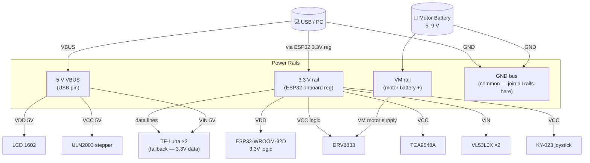
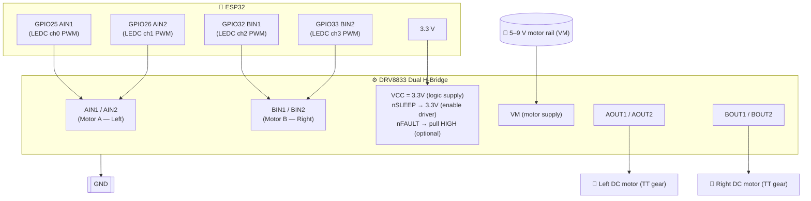
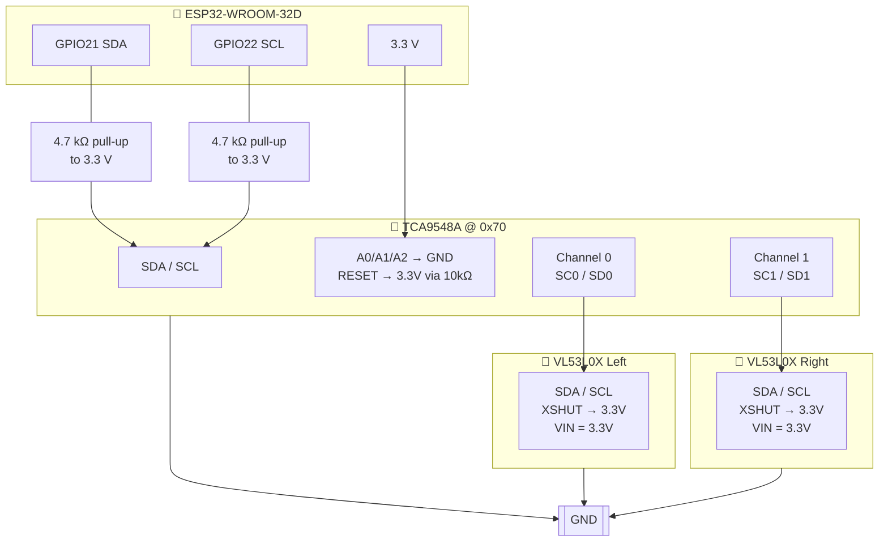
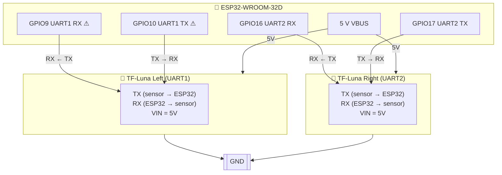
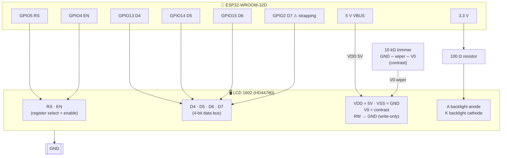
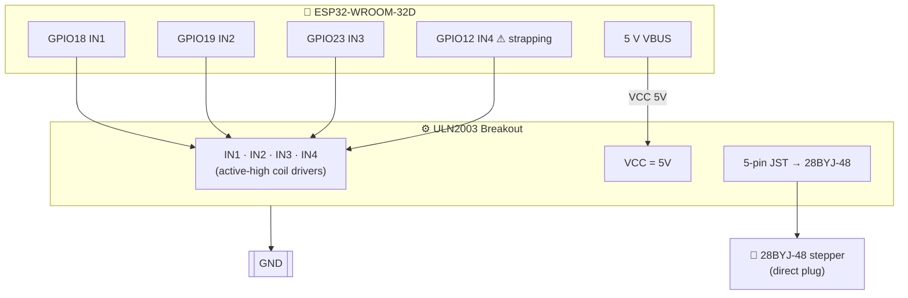

# Runbook 06 — Hardware Wiring

> **Audience:** Engineers assembling the robot from parts.
>
> **See also:** [Runbook 10 — Step-by-Step Flashing and Wiring Guide](10-flashing-and-wiring-guide.md)
> for a complete end-to-end walkthrough with Mermaid wiring diagram, BOM, and first-boot checklist.

---

## 1  Power architecture

The robot uses **two separate power rails**.  Mixing them can brown-out the MCU
or damage components.



> ⚠ **Always connect GND between all power rails.**  A floating ground between
> the motor battery and the logic supply will cause erratic behaviour or
> permanent MCU damage.

---

## 2  DRV8833 motor driver

The DRV8833 is a dual H-bridge.  Each bridge is controlled by two pins:

```
AIN1  AIN2 → Left  motor (Motor A)
BIN1  BIN2 → Right motor (Motor B)

Truth table (fast-decay mode used in firmware):
  AIN1 = PWM duty   AIN2 = 0%  → forward
  AIN1 = 0%         AIN2 = PWM → reverse
  AIN1 = 0%         AIN2 = 0%  → coast (free-wheel)
```

### Wiring



> If the robot drives one wheel backwards unexpectedly, swap the `AOUT1`/`AOUT2`
> wires for that motor (or negate the throttle in `config.rs`).

---

## 3  VL53L0X Time-of-Flight LIDAR (×2, via TCA9548A multiplexer)

Both VL53L0X sensors share the fixed I2C address `0x29`.  A **TCA9548A / PCA9548A**
8-channel I2C multiplexer is required to operate them on the same bus.

### TCA9548A connector pinout (8-pin breakout)

```
Pin  Signal  Function
──────────────────────────────────────────────────
VCC         3.3 V power
GND         Ground
SDA         I2C data  (connected to ESP32 GPIO21)
SCL         I2C clock (connected to ESP32 GPIO22)
A0          Address bit 0 — tie to GND for address 0x70
A1          Address bit 1 — tie to GND for address 0x70
A2          Address bit 2 — tie to GND for address 0x70
RESET       Active-low reset — tie HIGH (3.3 V) for normal operation
SC0 / SD0   Downstream channel 0 SCL / SDA → LIDAR Left
SC1 / SD1   Downstream channel 1 SCL / SDA → LIDAR Right
```

### Wiring — TCA9548A + VL53L0X to ESP32



> ⚠ **Pull-up resistors:** Most breakout boards for the TCA9548A and VL53L0X
> include 4.7 kΩ pull-up resistors on SCL/SDA.  Do **not** add additional
> pull-ups on the upstream bus; too many parallel pull-ups will lower the
> effective resistance and violate I2C timing.

---

## 3b  TF-Luna LIDAR (×2) — retained as fallback

The TF-Luna UART adapter code is kept in the repository as an alternative to the
VL53L0X I2C path.  Use the TF-Luna if the VL53L0X sensors are unavailable.

The TF-Luna uses **UART at 115 200 baud**.  It **transmits continuously at up
to 100 Hz** — the firmware only needs the RX line.  The TX line (ESP32 → sensor)
is connected but unused in streaming mode.

### Connector pinout (TF-Luna 4-pin JST-GH 1.25 mm)

```
Pin 1: VIN   ── 5 V power supply
Pin 2: GND
Pin 3: TX    ── sensor transmits → ESP32 RX GPIO
Pin 4: RX    ── sensor receives  ← ESP32 TX GPIO (optional in streaming mode)
```

### Wiring — LIDAR left (UART1) and right (UART2)



> ⚠ **GPIO 9/10 conflict:** On the ESP32-WROOM-32D, GPIO 6–11 are internally
> connected to the quad-SPI flash.  Some boards expose GPIO9/10 on headers
> despite this overlap.  If the board **resets on boot** or the LIDAR reads
> are always stale, remap LIDAR-L to the safe pins:
>
> ```rust
> // src/config.rs
> pub const LIDAR_L_RX_GPIO: u8 = 22;
> pub const LIDAR_L_TX_GPIO: u8 = 23;
> ```
>
> Then reconnect the TF-Luna TX → GPIO22 and RX → GPIO23.

---

## 4  LCD 1602 (HD44780, 4-bit parallel, no I2C backplate)

A standard 16-character × 2-line character display driven directly over 6 GPIO
pins.  The firmware uses write-only 4-bit mode — tie the **RW pin to GND**.

### Connector pinout (standard 1602 16-pin header)

```
Pin  Label  Function
─────────────────────────────────────────────────────
 1   VSS    GND
 2   VDD    5 V power (most 1602 panels require 5 V VDD)
 3   V0     Contrast adjust — connect to wiper of 10 kΩ pot (GND → wiper → V0)
 4   RS     Register select (0 = command, 1 = data)
 5   RW     Read/Write — tie to GND (write-only)
 6   EN     Enable clock (data latched on falling edge)
 7   D0     Not connected (4-bit mode uses only D4–D7)
 8   D1     Not connected
 9   D2     Not connected
10   D3     Not connected
11   D4     Data bit 4
12   D5     Data bit 5
13   D6     Data bit 6
14   D7     Data bit 7
15   A      Backlight anode  — connect via 100 Ω to 3.3 V or 5 V (optional)
16   K      Backlight cathode — connect to GND (optional)
```

### Wiring — LCD 1602 to ESP32



> ⚠ **Logic levels:** The ESP32 GPIO outputs 3.3 V logic.  The HD44780 accepts
> 3.3 V inputs reliably (Vil max = 0.6 × VDD; at VDD = 5 V this is 3.0 V, which
> is satisfied).  No level shifter is needed for RS/EN/D4–D7 when VDD = 5 V.
>
> ⚠ **GPIO2** is the boot-mode strapping pin.  It must be HIGH at reset for
> normal boot.  The LCD D7 line holds GPIO2 HIGH through the 1602 pull-up path;
> verify that the display does not pull GPIO2 LOW during power-on.  If boot
> issues occur, relocate D7 to another free GPIO (e.g. GPIO0 is not safe either;
> try GPIO34, but then change `LCD_D7_GPIO` in `config.rs`).

---

## 5  ULN2003 stepper driver (28BYJ-48)

The ULN2003 breakout accepts four TTL control signals and drives the four coils
of the 28BYJ-48 unipolar stepper motor using open-collector outputs.

### Connector pinout (ULN2003 breakout — 5-pin motor connector)

```
Pin  Label  Function
───────────────────────────────────────────
IN1         Coil A control (active-high)
IN2         Coil B control
IN3         Coil C control
IN4         Coil D control
VCC         Motor supply (5 V recommended)
GND         Ground
```

### 28BYJ-48 connector (5-pin JST connector on motor)

The motor plugs directly into the ULN2003 breakout board; no separate wiring is
needed between the motor and the driver board.

### Wiring — ULN2003 breakout to ESP32



> **Half-step sequence:** The firmware drives the motor with an 8-phase
> half-step sequence for smooth low-vibration motion.  Step delay is set by
> `STEPPER_STEP_DELAY_US` in `config.rs` (default 2 000 µs ≈ 15 rpm shaft).
>
> **Current:** The 28BYJ-48 draws ≈ 240 mA at 5 V.  A USB port can typically
> supply this; a dedicated 5 V / 0.5 A supply is recommended if both LIDARs
> and the stepper run simultaneously.

---

## 6  KY-023 Joystick

```mermaid
flowchart LR
    subgraph ESP32["🧠 ESP32"]
        VP36["GPIO36 VP\n(ADC1 ch0 — input-only)"]
        VN39["GPIO39 VN\n(ADC1 ch3 — input-only)"]
        SW27["GPIO27 SW\n(internal pull-up enabled)"]
        VCC33J["3.3 V"]
    end

    GND[["GND"]]

    subgraph JOY_BLK["🕹 KY-023 Joystick"]
        VRX["VRX (X-axis potentiometer\n0–3.3 V)"]
        VRY["VRY (Y-axis potentiometer\n0–3.3 V)"]
        SWJ["SW (push button, active-low)"]
    end

    VP36    <-- VRX
    VN39    <-- VRY
    SW27    <-- SWJ
    VCC33J  -->|"VCC"| JOY_BLK
    JOY_BLK --> GND
```

GPIO36 and GPIO39 are **input-only** pins — they have no internal pull
resistors and cannot be driven as outputs.  They connect directly to the
joystick potentiometer output (0–3.3 V swing).

GPIO27 supports the internal pull-up.  No external resistor is needed.

> **Calibration:** If the robot drifts slightly at rest, adjust
> `JOY_CENTER_RAW` and `DEAD_ZONE_RAW` in `config.rs` to match your
> joystick's actual centre voltage.

---

## 7  Full wiring summary

```mermaid
flowchart TB
    %% ── Power sources ────────────────────────────────
    USB[("💻 USB / PC")]
    BATT[("🔋 5–9 V motor battery")]

    %% ── Power rails ─────────────────────────────────
    R33["3.3 V rail"]
    R5["5 V VBUS"]
    VM["VM (motor supply)"]
    GND[["GND bus (common)"]]

    USB  -->|"VBUS"| R5
    USB  -->|"via reg"| R33
    USB  --> GND
    BATT --> VM
    BATT --> GND

    %% ── ESP32 ────────────────────────────────────────
    subgraph MCU["🧠 ESP32-WROOM-32D"]
        MPINS["GPIO25 AIN1 · GPIO26 AIN2\nGPIO32 BIN1 · GPIO33 BIN2"]
        I2C["GPIO21 SDA · GPIO22 SCL\n+ 4.7kΩ pull-ups → 3.3V"]
        LPINS["GPIO5 RS · GPIO4 EN\nGPIO13 D4 · GPIO14 D5\nGPIO15 D6 · GPIO2 D7 ⚠"]
        SPINS["GPIO18 IN1 · GPIO19 IN2\nGPIO23 IN3 · GPIO12 IN4 ⚠"]
        JPINS["GPIO36 VP · GPIO39 VN\nGPIO27 SW"]
        UPINS["GPIO9 UART1-RX · GPIO10 UART1-TX ⚠\nGPIO16 UART2-RX · GPIO17 UART2-TX"]
    end
    R33 --> MCU
    R5  --> MCU

    %% ── DRV8833 ──────────────────────────────────────
    subgraph DRIVE["⚙ Motor Drive"]
        DRV["DRV8833\nVCC=3.3V · VM=motor rail\nnSLEEP→3.3V"]
        ML["Left DC motor"]
        MR["Right DC motor"]
        DRV -->|"AOUT1/2"| ML
        DRV -->|"BOUT1/2"| MR
    end
    MPINS --> DRV
    R33   -->|"VCC"| DRV
    VM    -->|"VM"| DRV
    DRV   --> GND

    %% ── I2C LIDAR ────────────────────────────────────
    subgraph LIDAR_I2C["📡 I2C LIDAR chain"]
        MUX["TCA9548A @ 0x70\nA0–A2→GND · RESET→3.3V"]
        VLX_L["VL53L0X Left\n0x29 @ CH0 · XSHUT→3.3V"]
        VLX_R["VL53L0X Right\n0x29 @ CH1 · XSHUT→3.3V"]
        MUX -->|"SC0/SD0"| VLX_L
        MUX -->|"SC1/SD1"| VLX_R
    end
    I2C  --> MUX
    R33  -->|"VCC"| MUX
    R33  -->|"VIN"| VLX_L
    R33  -->|"VIN"| VLX_R
    MUX  --> GND
    VLX_L --> GND
    VLX_R --> GND

    %% ── TF-Luna fallback ─────────────────────────────
    subgraph TFL["📡 TF-Luna fallback"]
        TFL_L["TF-Luna Left\n5V · UART1"]
        TFL_R["TF-Luna Right\n5V · UART2"]
    end
    UPINS -->|"UART1"| TFL_L
    UPINS -->|"UART2"| TFL_R
    R5    -->|"5V VIN"| TFL_L
    R5    -->|"5V VIN"| TFL_R
    TFL   --> GND

    %% ── LCD ─────────────────────────────────────────
    subgraph DISP["🖥 LCD 1602"]
        LCD["HD44780 4-bit\nVDD=5V · RW→GND\nA→3.3V via 100Ω"]
        POT["10kΩ contrast trimmer\nGND→wiper→V0"]
        LCD --- POT
    end
    LPINS -->|"RS/EN/D4–D7"| LCD
    R5    -->|"VDD 5V"| LCD
    LCD   --> GND

    %% ── Stepper ──────────────────────────────────────
    subgraph STEP["🔩 Stepper"]
        ULN["ULN2003 · VCC=5V"]
        SM["28BYJ-48\n5-pin JST"]
        ULN --> SM
    end
    SPINS -->|"IN1–IN4"| ULN
    R5    -->|"VCC 5V"| ULN
    ULN   --> GND

    %% ── Joystick ─────────────────────────────────────
    subgraph JOY_G["🕹 Joystick"]
        JOY["KY-023\nVCC=3.3V"]
    end
    JPINS -->|"VRX/VRY/SW"| JOY
    R33   -->|"VCC"| JOY
    JOY   --> GND
```



---

## 8  Assembly checklist

Before powering on:

- [ ] Common GND connected between logic rail, motor rail, and all sensors
- [ ] DRV8833 VM connected to motor battery (not to 3.3 V)
- [ ] TCA9548A A0–A2 and RESET wired correctly (A0–A2 → GND, RESET → 3.3 V)
- [ ] VL53L0X XSHUT pins pulled HIGH (3.3 V); both sensors wired to correct mux channels
- [ ] LCD VDD connected to 5 V; RW pin tied to GND; contrast trimmer present
- [ ] ULN2003 VCC connected to 5 V; IN1–IN4 connected in correct order
- [ ] Joystick SW connected to GPIO27 (not GPIO34–39 which lack pull-up)
- [ ] Motor terminals connected — check polarity with a brief manual test
- [ ] No short circuits between 5 V motor rail and 3.3 V logic rail

After first boot:

- [ ] Serial log shows all peripherals initialised
- [ ] LCD shows "Idle" on row 0 within 200 ms
- [ ] Both LIDAR readings appear on LCD row 1 and in telemetry (not `None`)
- [ ] Hold joystick button ≥ 1 s → enters `DIRECT`; LCD row 1 switches to `L±xx R±xx` throttle format
- [ ] Joystick moves both wheels in correct directions
- [ ] Button triggers state transitions as expected
- [ ] Stepper responds to `stepper.step(512)` test call (one full shaft revolution)
