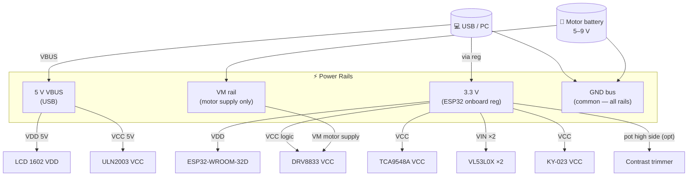
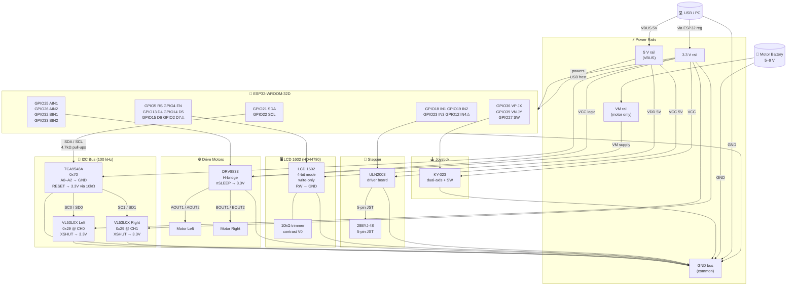
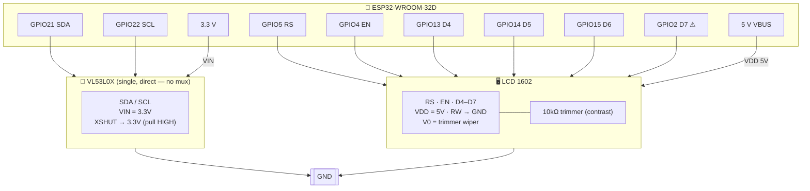

# Runbook 10 — Step-by-Step Flashing and Wiring Guide

> **Audience:** Someone assembling and programming the robot from scratch.
> This guide covers the complete path from bare components to a running robot.
>
> **Variants covered:**
> - **Production** (`main`) — TCA9548A mux + 2× VL53L0X + WiFi
> - **Dev** (`--features dev`) — single VL53L0X direct, no mux, no WiFi

---

## Part A — Hardware Wiring

### A1  Bill of Materials

| # | Component | Qty | Notes |
|---|-----------|-----|-------|
| 1 | ESP32-WROOM-32D dev board | 1 | 38-pin variant |
| 2 | TCA9548A or PCA9548A breakout | 1 | 8-ch I2C switch; skip for dev variant |
| 3 | VL53L0X Time-of-Flight breakout | 2 (prod) / 1 (dev) | Standard breakout with onboard 3.3V reg |
| 4 | DRV8833 motor driver breakout | 1 | Dual H-bridge |
| 5 | DC gear motor (TT motor) | 2 | Left and right drive wheels |
| 6 | LCD 1602 (HD44780, no I2C backplate) | 1 | 16 cols × 2 rows, 5V panel |
| 7 | 10 kΩ trimmer/potentiometer | 1 | LCD contrast adjust |
| 8 | 100 Ω resistor | 1 | LCD backlight current limiter |
| 9 | ULN2003 driver board | 1 | For 28BYJ-48 stepper |
| 10 | 28BYJ-48 stepper motor | 1 | Plugs directly to ULN2003 board |
| 11 | KY-023 joystick module | 1 | Dual-axis + push button |
| 12 | 4.7 kΩ resistor (×2) or pull-up on breakout | 2 | I2C pull-ups for SDA/SCL upstream bus |
| 13 | 10 kΩ resistor | 1 | TCA9548A RESET pull-up |
| 14 | USB-A to micro-USB cable | 1 | Flashing + logic power |
| 15 | Motor power supply (5V–9V) | 1 | Separate rail for motors |
| 16 | Breadboard + jumper wires | — | — |

---

### A2  Power Rail Strategy

> ⚠ **Critical:** The robot uses two separate power rails. Never bridge 5V–9V motor
> supply directly to the 3.3V logic rail.



**Step-by-step power wiring:**

1. Connect ESP32 **GND** to breadboard ground bus.
2. Connect motor battery **GND** to the same ground bus.
3. Connect USB power supply **GND** to the same ground bus.
4. Connect ESP32 **3.3V** pin to breadboard 3.3V bus.
5. Connect ESP32 **5V (VBUS)** pin to breadboard 5V bus.
   (The VBUS pin is live whenever USB is connected — do not connect motor battery here.)
6. Connect motor battery **positive** to a separate labelled column on the breadboard (VM rail).
   Do **not** connect VM to the 3.3V or 5V buses.

---

### A3  Wire the I2C Bus — TCA9548A Multiplexer (Production Only)

> **Skip this section for the dev variant** — the dev binary uses a single VL53L0X
> wired directly to SDA/SCL without a mux.

The TCA9548A sits on the upstream I2C bus and routes channel 0 to the left sensor
and channel 1 to the right sensor. All three nodes (ESP32, TCA9548A, both VL53L0X)
share a common 3.3V and GND.

**TCA9548A upstream connections (to ESP32):**

| TCA9548A Pin | Connect to | Notes |
|---|---|---|
| VCC | 3.3V rail | |
| GND | GND bus | |
| SDA | GPIO21 | Upstream I2C SDA |
| SCL | GPIO22 | Upstream I2C SCL |
| A0 | GND | ) Address pins — all to GND |
| A1 | GND | ) sets device address to 0x70 |
| A2 | GND | ) |
| RESET | 3.3V via 10 kΩ | Pull-up; never leave floating |

> ⚠ **RESET must never float.** A floating RESET causes random mux resets
> from board noise, producing mysterious intermittent I2C failures.

**Pull-up resistors:**
Add 4.7 kΩ resistors from SDA (GPIO21) → 3.3V and SCL (GPIO22) → 3.3V
on the upstream bus, unless the TCA9548A breakout board already includes them.
Do **not** add additional pull-ups on the downstream (sensor-side) channels.

---

### A4  Wire the VL53L0X Sensors

#### Left sensor → TCA9548A channel 0

| VL53L0X Left | Connect to | Notes |
|---|---|---|
| VIN | 3.3V rail | Breakout onboard regulator accepts 3.3V or 5V |
| GND | GND bus | |
| SCL | TCA9548A SC0 | Channel 0 clock |
| SDA | TCA9548A SD0 | Channel 0 data |
| XSHUT | 3.3V rail | Pull HIGH — holds sensor active |
| GPIO1 | not connected | Interrupt output; firmware uses polling |

#### Right sensor → TCA9548A channel 1

| VL53L0X Right | Connect to | Notes |
|---|---|---|
| VIN | 3.3V rail | |
| GND | GND bus | |
| SCL | TCA9548A SC1 | Channel 1 clock |
| SDA | TCA9548A SD1 | Channel 1 data |
| XSHUT | 3.3V rail | Pull HIGH |
| GPIO1 | not connected | |

#### Dev variant — single VL53L0X direct

For the dev binary (`--features dev`), wire the single sensor directly to the ESP32:

| VL53L0X | Connect to | Notes |
|---|---|---|
| VIN | 3.3V rail | |
| GND | GND bus | |
| SCL | GPIO22 | Direct I2C SCL |
| SDA | GPIO21 | Direct I2C SDA |
| XSHUT | 3.3V rail | Pull HIGH |
| GPIO1 | not connected | |

---

### A5  Wire the DRV8833 Motor Driver

The DRV8833 has separate logic (VCC) and motor (VM) supplies.
**Logic:** 3.3V from ESP32. **Motor supply:** VM rail (motor battery).

| DRV8833 Pin | Connect to | Notes |
|---|---|---|
| VCC | 3.3V rail | Logic supply |
| GND | GND bus | |
| VM | Motor battery + (VM rail) | Motor supply — **not** 3.3V |
| AIN1 | GPIO25 | Left motor forward |
| AIN2 | GPIO26 | Left motor reverse |
| BIN1 | GPIO32 | Right motor forward |
| BIN2 | GPIO33 | Right motor reverse |
| AOUT1 | Left motor terminal A | |
| AOUT2 | Left motor terminal B | |
| BOUT1 | Right motor terminal A | |
| BOUT2 | Right motor terminal B | |
| nSLEEP | 3.3V rail | Pull HIGH to enable driver |
| nFAULT | optional | Pull HIGH; monitor for overcurrent faults |

> If a wheel drives backwards unexpectedly, swap AOUT1/AOUT2 for that motor
> (physical swap — no firmware change needed).

---

### A6  Wire the LCD 1602

The HD44780 panel runs on **5V VDD** but accepts 3.3V logic signals from the ESP32
(V_IL max = 0.6 × VDD = 3.0V at 5V, satisfied by 3.3V GPIO output).
No level shifter is needed for control lines.

The firmware uses **4-bit mode, write-only** — pins D0–D3 and RW are not used.

| LCD Pin | Label | Connect to | Notes |
|---|---|---|---|
| 1 | VSS | GND bus | |
| 2 | VDD | 5V bus (VBUS) | Must be 5V — 3.3V will give dim/no display |
| 3 | V0 | Trimmer wiper | Contrast: GND → wiper → V0; trimmer other end to VDD |
| 4 | RS | GPIO5 | Register select |
| 5 | RW | GND bus | Write-only; never connect to ESP32 GPIO |
| 6 | EN | GPIO4 | Enable clock |
| 7–10 | D0–D3 | not connected | Not used in 4-bit mode |
| 11 | D4 | GPIO13 | |
| 12 | D5 | GPIO14 | |
| 13 | D6 | GPIO15 | |
| 14 | D7 | GPIO2 | ⚠ See note |
| 15 | A | 3.3V via 100 Ω | Backlight anode (optional) |
| 16 | K | GND bus | Backlight cathode |

> ⚠ **GPIO2 is a boot-mode strapping pin.** It must read HIGH at reset for normal boot.
> The D7 connection holds GPIO2 HIGH through the LCD bus — this is safe in normal
> operation. If the ESP32 refuses to boot, temporarily disconnect GPIO2 from D7
> during the reset, or relocate D7 to GPIO34 (update `LCD_D7_GPIO` in `config.rs`).

> ⚠ **GPIO12 (STEPPER IN4)** is also a strapping pin on some ESP32 variants.
> It must be LOW at reset (default state with no signal). The ULN2003 IN4 connection
> is LOW by default — this is safe. Do not add a pull-up to GPIO12.

---

### A7  Wire the ULN2003 Stepper Driver

The 28BYJ-48 motor plugs directly onto the ULN2003 board's 5-pin JST connector.
Only the control lines and power need external wiring.

| ULN2003 Pin | Connect to | Notes |
|---|---|---|
| IN1 | GPIO18 | Coil A |
| IN2 | GPIO19 | Coil B |
| IN3 | GPIO23 | Coil C |
| IN4 | GPIO12 | Coil D ⚠ strapping pin — keep LOW at reset |
| VCC | 5V bus (VBUS) | Motor supply — minimum 5V |
| GND | GND bus | |

> The 28BYJ-48 draws ~240 mA at 5V. If the ESP32 reboots when the stepper
> starts, the USB port cannot supply enough current. Use a dedicated 5V/1A
> supply connected to the 5V bus (not USB).

---

### A8  Wire the KY-023 Joystick

| KY-023 Pin | Connect to | Notes |
|---|---|---|
| VCC | 3.3V rail | |
| GND | GND bus | |
| VRX | GPIO36 (VP) | X axis — ADC1 ch0, input-only pin, no pull |
| VRY | GPIO39 (VN) | Y axis — ADC1 ch3, input-only pin, no pull |
| SW | GPIO27 | Active-low push button; internal pull-up enabled |

> GPIO36 and GPIO39 are **input-only** — they have no internal pull resistors
> and cannot drive outputs. Connect directly; no external resistor needed.
> GPIO27 is the only safe choice for SW among the upper GPIO range — GPIO34–39
> lack internal pull-up support.

> **DIRECT control mode (dev only):**
> While the LCD shows `IDLE`, **hold** the joystick button (SW / GPIO27) for
> **≥ 1 second** to enter **DIRECT** mode.  In DIRECT mode every joystick
> movement is passed straight to the drive motors — useful for manual driving
> on the bench without recording a path.  Press the button once (short press) to
> exit back to `IDLE` and coast the motors.
>
> A short press from `IDLE` (< 1 s) still begins a normal RECORD session.

---

### A9  Wiring Diagram



---

### A10  Full GPIO Reference

| GPIO | Function | Direction | Level | Notes |
|---|---|---|---|---|
| **2** | LCD D7 | OUT | 3.3V | ⚠ Boot strap pin — HIGH at reset required |
| **4** | LCD EN | OUT | 3.3V | HD44780 enable clock |
| **5** | LCD RS | OUT | 3.3V | HD44780 register select |
| **12** | Stepper IN4 | OUT | 3.3V | ⚠ Boot strap on some variants — must be LOW at reset |
| **13** | LCD D4 | OUT | 3.3V | |
| **14** | LCD D5 | OUT | 3.3V | |
| **15** | LCD D6 | OUT | 3.3V | |
| **18** | Stepper IN1 | OUT | 3.3V | ULN2003 coil A |
| **19** | Stepper IN2 | OUT | 3.3V | ULN2003 coil B |
| **21** | I2C SDA | I/O | 3.3V | 4.7 kΩ pull-up to 3.3V on upstream bus |
| **22** | I2C SCL | I/O | 3.3V | 4.7 kΩ pull-up to 3.3V on upstream bus |
| **23** | Stepper IN3 | OUT | 3.3V | ULN2003 coil C |
| **25** | Motor AIN1 | OUT (PWM) | 3.3V | Left motor fwd (LEDC ch0) |
| **26** | Motor AIN2 | OUT (PWM) | 3.3V | Left motor rev (LEDC ch1) |
| **27** | Joystick SW | IN | 3.3V | Active-low; internal pull-up |
| **32** | Motor BIN1 | OUT (PWM) | 3.3V | Right motor fwd (LEDC ch2) |
| **33** | Motor BIN2 | OUT (PWM) | 3.3V | Right motor rev (LEDC ch3) |
| **36 (VP)** | Joystick X | IN (ADC1 ch0) | 0–3.3V | Input-only; no pull resistor |
| **39 (VN)** | Joystick Y | IN (ADC1 ch3) | 0–3.3V | Input-only; no pull resistor |
| **6–11** | ⛔ Reserved | — | — | Internal quad-SPI flash — do not connect |

---

### A11  Pre-Power Assembly Checklist

Before connecting any power source:

- [ ] Common GND bus connected between USB GND, motor battery GND, and all components
- [ ] VM rail (motor battery) isolated from 3.3V and 5V buses
- [ ] DRV8833 nSLEEP pulled HIGH (3.3V); VM connected to motor battery rail (not 3.3V)
- [ ] TCA9548A: A0–A2 → GND; RESET → 3.3V via 10 kΩ (production only)
- [ ] TCA9548A: SDA/SCL upstream pull-ups (4.7 kΩ to 3.3V) present — not doubled
- [ ] VL53L0X XSHUT pins pulled HIGH (3.3V) on both sensors
- [ ] VL53L0X sensors wired to correct TCA9548A downstream channels (L→CH0, R→CH1)
- [ ] LCD VDD connected to 5V (not 3.3V); RW pin tied to GND (not GPIO)
- [ ] LCD contrast trimmer wired: GND → wiper → V0; other end → VDD
- [ ] ULN2003 VCC connected to 5V; stepper plugged into JST connector
- [ ] GPIO12 (Stepper IN4) default state LOW — no pull-up attached to GPIO12
- [ ] GPIO2 (LCD D7) — no pull-down attached; LCD bus holds it HIGH by default
- [ ] Joystick SW connected to GPIO27 (not GPIO34–39)
- [ ] No short circuits between VM rail and 3.3V/5V buses (use a multimeter)

---

## Part B — Flashing the Firmware

### B1  Install Prerequisites

Install these once per development machine (see Runbook 01 for full details):

```bash
# 1. Stable Rust (for host tests)
rustup toolchain install stable

# 2. ESP Rust toolchain + Xtensa LLVM backend
cargo install espup
espup install
source ~/export-esp.sh           # or add to ~/.zshrc / ~/.bashrc

# 3. Flash tool
cargo install espflash           # must be ≥ 3.0

# 4. USB-UART driver (macOS — for CH340 boards)
brew install --cask wch-ch34x-usb-serial-driver
```

Verify the toolchain:

```bash
cargo +esp --version
espflash --version
```

---

### B2  Configure the Firmware

Edit `src/config.rs` before building:

```rust
// WiFi credentials (production build only — not needed for dev variant)
pub const WIFI_SSID:     &str = "YourNetwork";
pub const WIFI_PASSWORD: &str = "YourPassword";
```

All GPIO constants default to the wiring described in Part A.
If you deviate from the documented pinout, update the matching constant.

---

### B3  Run Host Unit Tests

Run this before every flash to catch logic regressions without hardware:

```bash
cargo +stable test --lib --target aarch64-apple-darwin
# Expected: test result: ok. 47 passed; 0 failed
```

---

### B4  Build the Firmware

**Production build** (WiFi + 2× VL53L0X via TCA9548A):
```bash
cargo +esp build --release
# ELF: target/xtensa-esp32-none-elf/release/path-following-robot
```

**Dev build** (single VL53L0X, LCD debug, no WiFi, no mux):
```bash
cargo build-dev
# alias for: cargo +esp build --features dev --bin path-following-robot-dev
# ELF: target/xtensa-esp32-none-elf/debug/path-following-robot-dev
```

**Sim build** (Wokwi, no real hardware):
```bash
cargo build-sim
# alias for: cargo +esp build --features sim --bin path-following-robot-sim
```

Check binary size (optional):
```bash
cargo +esp size --release -- -A
```

---

### B5  Put the ESP32 into Download Mode

Most ESP32 dev boards have an on-board auto-reset circuit that enters download
mode automatically. If auto-reset works, skip this step.

**If auto-reset does not work (manual download mode):**

1. Connect USB to your computer.
2. Hold the **BOOT** button (IO0).
3. Press and release the **RESET** (EN) button while holding BOOT.
4. Release the **BOOT** button.
5. The board is now in download mode — the serial monitor will show no output
   (chip is halted, waiting for firmware).

---

### B6  Identify the Serial Port

```bash
# macOS
ls /dev/cu.usbserial*
# typical: /dev/cu.usbserial-0001  or  /dev/cu.SLAB_USBtoUART

# Linux
ls /dev/ttyUSB* /dev/ttyACM*
# typical: /dev/ttyUSB0

# If multiple ports appear, disconnect/reconnect USB and diff the output
```

---

### B7  Flash the Firmware

**Option 1 — Flash + auto-run (production, recommended):**
```bash
cargo +esp run --release
# Builds, flashes, and opens the serial monitor automatically
```

**Option 2 — Flash only (specify port if auto-detect fails):**
```bash
espflash flash \
  --port /dev/cu.usbserial-0001 \
  target/xtensa-esp32-none-elf/release/path-following-robot
```

**Option 3 — Dev variant flash:**
```bash
espflash flash \
  --port /dev/cu.usbserial-0001 \
  target/xtensa-esp32-none-elf/debug/path-following-robot-dev
```

**Option 4 — Flash + built-in monitor:**
```bash
espflash flash --monitor \
  target/xtensa-esp32-none-elf/release/path-following-robot
```

> If flashing fails with "Failed to connect", try manual download mode (Step B5),
> or try a different USB cable (some cables are charge-only).

---

### B8  Open the Serial Monitor

The firmware logs to UART0 at **115 200 baud** via `esp-println`.

```bash
# espflash built-in monitor
espflash monitor --port /dev/cu.usbserial-0001

# macOS screen (Ctrl-A, Ctrl-\ to exit)
screen /dev/cu.usbserial-0001 115200

# Linux minicom
minicom -D /dev/ttyUSB0 -b 115200
```

**Log level** is set in the binary source (`main.rs` / `main_dev.rs`):

| Constant | Content |
|---|---|
| `LevelFilter::Info` (default) | State transitions, WiFi events, init messages |
| `LevelFilter::Debug` | LIDAR readings, tick timing, command receipt |
| `LevelFilter::Trace` | Raw I2C bytes, ADC values, every tick entry |

---

### B9  Boot Log — Expected Output

**Production binary:**
```
I (321) robot: I2C: SDA=GPIO21  SCL=GPIO22  freq=100000Hz
I (330) robot: TCA9548A: address=0x70
I (345) robot: VL53L0X left:  channel=0  addr=0x29  init OK
I (360) robot: VL53L0X right: channel=1  addr=0x29  init OK
I (370) robot: LCD: RS=5 EN=4 D4-D7=13,14,15,2
I (380) robot: ULN2003: IN1-IN4=18,19,23,12
I (390) robot: WiFi connecting to "YourNetwork"...
I (4200) robot: WiFi: connected — IP 192.168.1.42
I (4201) robot: State: IDLE
```

**Dev binary:**
```
I (321) robot: I2C: SDA=GPIO21  SCL=GPIO22  freq=100000Hz
I (340) robot: VL53L0X direct: addr=0x29  init OK
I (355) robot: LCD: RS=5 EN=4 D4-D7=13,14,15,2
I (365) robot: ULN2003: IN1-IN4=18,19,23,12
I (370) robot: WiFi: disabled (dev variant)
I (372) robot: State: IDLE
```

---

### B10  First-Boot Verification Checklist

After the boot log shows `State: IDLE`:

**Hardware verification:**
- [ ] LCD row 0 shows `Idle` within 200 ms of `State: IDLE` log entry
- [ ] LCD row 1 shows `L xxx R ---` (left sensor live, right stub at 200 cm in dev) or `L xxx R yyy` in production
- [ ] Joystick X/Y movement changes motor PWM (check log or listen for motor hum)
- [ ] Joystick button press triggers state transition (`IDLE` → `PLAY`)
- [ ] Both wheels spin in the correct direction when joystick is pushed forward
- [ ] Stepper responds: send `stepper.step(512)` test call = one full shaft revolution
- [ ] No `ERROR` lines in the serial log

**Production-only:**
- [ ] WiFi connected — IP address printed in log
- [ ] Telemetry JSON visible on UDP port 9001 (use Runbook 04)

**If a sensor shows `None` in telemetry:**
- Check XSHUT is HIGH (3.3V)
- Check the TCA9548A RESET is HIGH and A0–A2 are GND
- Verify the downstream SCL/SDA wires go to the correct TCA9548A channel
- Try lowering I2C frequency to 50 kHz: `I2C_FREQ_HZ: u32 = 50_000` in `config.rs`

---

## Appendix — Dev Variant Wiring Summary

Minimum wiring for bench testing with one sensor and LCD debug output.
No TCA9548A required. No WiFi needed.



LCD debug layout:
```
Row 0: current FSM state name    (e.g. "Play", "Avoiding", "Halt")
Row 1: left LIDAR distance in cm (e.g. "L  42 cm")
```

Build and flash:
```bash
cargo build-dev
espflash flash --monitor \
  target/xtensa-esp32-none-elf/debug/path-following-robot-dev
```
